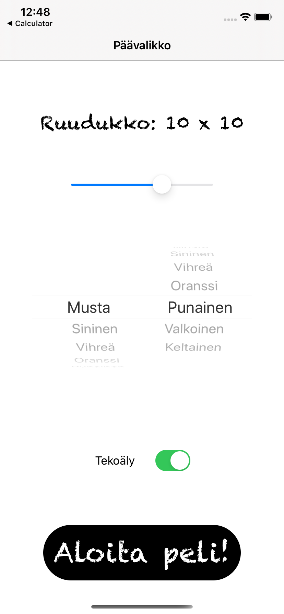
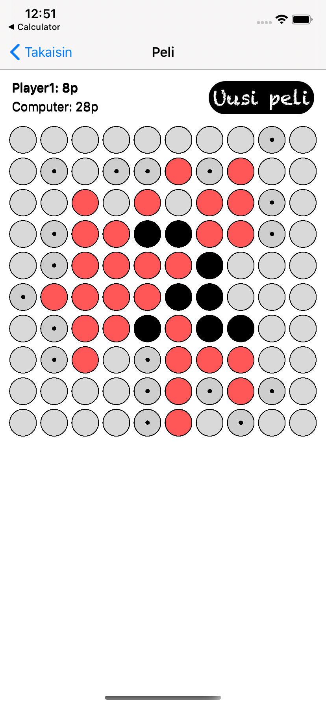

# Othello
Classic Othello game with customization, local multiplayer, and a simple AI opponent

# Menu
In the menu, the user can customize the player colors and the board size. They can also choose to play against AI.

# Game
In the game view, the possible moves are displayed with dots. The active player is indicated with a bold font.

